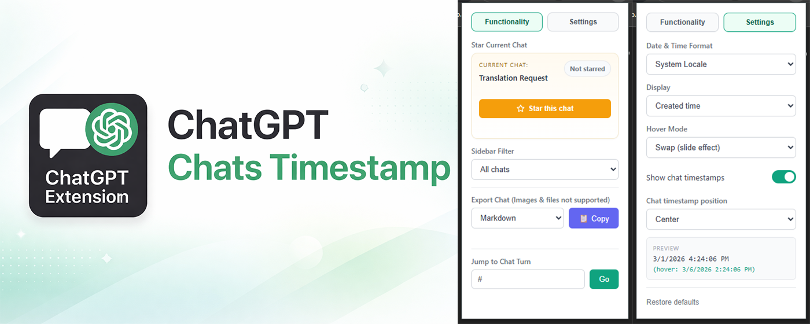

# ChatGPT Chats Timestamp

<a title="Users" target="_blank" href="https://chromewebstore.google.com/detail/chatgpt-chats-timestamp/fjfjjofbppklnihhhdfcojbdbghpolhm"></a>
<a title="Version" target="_blank" href="https://chromewebstore.google.com/detail/chatgpt-chats-timestamp/fjfjjofbppklnihhhdfcojbdbghpolhm"></a>



See exactly when each conversation was created in the sidebar.

How to use:
Install the extension and open ChatGPT – timestamps appear automatically! Click the extension icon to customize date formats, toggle in-chat timestamps, and adjust display preferences.

💬 In-Chat Message Timestamps (enabled by default)
Every message in your conversation displays its timestamp. Don't need it? Easily toggle it off in settings.

⭐ Bookmarks with Folders & Notes
Star any chat for quick access, then organize your bookmarks into folders (up to 2 levels) and add personal notes so you remember why each chat matters. The new "Bookmarks" tab lets you rename folders, move bookmarks between them, jump straight into any saved chat, or wipe a whole view with a single "Unstar all" action.

📋 Export Chat
Export your entire conversation to clipboard in multiple formats – Markdown, Plain Text, or JSON.
Perfect for saving, sharing, or archiving your chats.

🎯 Jump to Message
Quickly navigate to any specific turn in your conversation with the jump-to feature.

⚙️ Fully Customizable
• Multiple date formats – locale-based, relative time ("2 days ago"), or custom
• Display modes – show created date, last updated, or both
• Hover modes – choose how additional timestamp details appear on hover
• Adjustable timestamp position
• Support dark mode and light mode

## Installation (Manual)

1. Clone this repository:
   ```bash
   git clone https://github.com/YOUR_USERNAME/chatgpt-chats-timestamp.git
   ```

2. Open Chrome and navigate to `chrome://extensions/`

3. Enable "Developer mode" (toggle in top right)

4. Click "Load unpacked"

5. Select the `src` folder from the cloned repository

## Usage

Once installed, the extension automatically displays timestamps next to your ChatGPT conversations in the sidebar. No configuration needed!

## License
Distributed under the [MIT](https://choosealicense.com/licenses/mit/) License.

## Contributing

Contributions are welcome! Feel free to open issues or submit pull requests.

[thought process](https://gist.github.com/eryet/6242ca9013dea5fb37b27d05617bf1b9)
