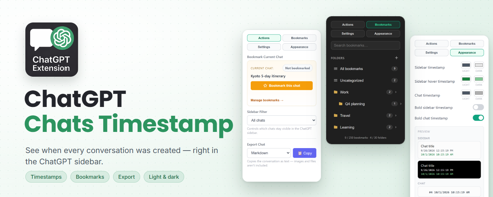
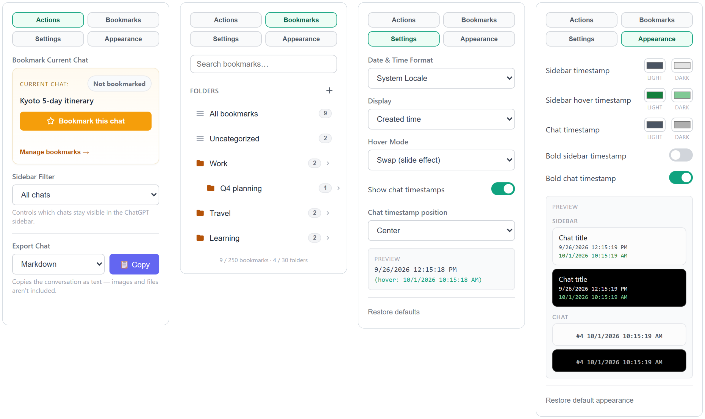

# ChatGPT Chats Timestamp

<a title="Users" target="_blank" href="https://chromewebstore.google.com/detail/chatgpt-chats-timestamp/fjfjjofbppklnihhhdfcojbdbghpolhm"></a>
<a title="Version" target="_blank" href="https://chromewebstore.google.com/detail/chatgpt-chats-timestamp/fjfjjofbppklnihhhdfcojbdbghpolhm"></a>
<a title="Latest release" target="_blank" href="https://github.com/eryet/chatgpt-chats-timestamp/releases/latest"></a>



See when every ChatGPT conversation was created, right in the sidebar. The extension also adds a time to each message, lets you bookmark chats into folders with notes, and copies conversations to your clipboard.

**[Install from the Chrome Web Store](https://chromewebstore.google.com/detail/chatgpt-chats-timestamp/fjfjjofbppklnihhhdfcojbdbghpolhm)** · [Download a release](https://github.com/eryet/chatgpt-chats-timestamp/releases/latest)

## Features

### 🕒 Sidebar timestamps

Every chat in the sidebar shows when it was created. Hover a chat to see when it was last updated. You can show the updated time by default instead, and choose how the hover works:

- **Swap**: the timestamp slides to the other time
- **Classic**: the other time appears below
- **Disabled**: no hover change

### 💬 Message timestamps

Each message shows its turn number and the time it was sent, like `#4 10/1/2026 10:15:25 AM`. Place it on the left, center, or right, or turn it off. Times come from data ChatGPT has already loaded. If a time isn't available, it stays blank instead of being guessed.

### ⭐ Bookmarks

- Bookmark the open chat from the popup. Bookmarked chats get a small star in the sidebar.
- Sort bookmarks into folders, with one level of subfolders.
- Add a note of up to 500 characters to remember why a chat matters.
- Search across titles and notes.
- Hover a bookmark to delete it, or remove every bookmark in a view at once.
- Use **Sidebar Filter** to show only bookmarked chats in the ChatGPT sidebar.

Bookmarks are saved to Chrome sync storage. If Chrome sync is on, they follow you to your other computers. You can keep up to 250 bookmarks and 30 folders, and the popup shows how many you've used.

### 📋 Export

Copy the open conversation to your clipboard as Markdown, plain text, or JSON. Export copies text only: images become `[Image]` and files become `[File: name]`.

### 🎨 Appearance

Pick your own colors for the sidebar timestamp, the hover timestamp, and the message timestamp. Each one has a separate color for ChatGPT's light and dark themes. You can also make the sidebar or message timestamps bold. A live preview shows each change on both themes.

### ⚙️ Settings

- **Date and time format:** system locale, ISO, US, EU, UK, relative ("2h ago"), short, date only, or time only
- **Display:** created time or last updated time
- **Hover mode:** Swap, Classic, or Disabled
- **Message timestamps:** on or off, and left, center, or right

### Also

- Works with chats inside projects.
- Group chats get sidebar timestamps and can be bookmarked and exported. ChatGPT already shows message times in group chats, so the extension doesn't add its own there.
- The popup follows your browser's light or dark theme.
- The popup is available in English and 繁體中文 (Traditional Chinese).
- After an extension update, the popup tells you to refresh any open ChatGPT tab that is still running the old version.

## Screenshots

The popup has four tabs: **Actions**, **Bookmarks**, **Settings**, and **Appearance**. This image matches your GitHub theme.

<picture>
  <source media="(prefers-color-scheme: dark)" srcset="screenshot/popup-tabs-dark.png">
  
</picture>

## Privacy

- The only permission is `storage`, and the extension runs only on `chatgpt.com` and `chat.openai.com`.
- The extension makes no network requests of its own. Message times are read from responses ChatGPT has already loaded. Only message IDs and times are kept, in memory, and message content is never stored.
- Settings and bookmarks are saved in Chrome sync storage. A bookmark holds the chat ID, title, folder, note, and date. Nothing is sent to the developer or any other server.

## Installation

### Chrome Web Store (recommended)

Install from the [Chrome Web Store](https://chromewebstore.google.com/detail/chatgpt-chats-timestamp/fjfjjofbppklnihhhdfcojbdbghpolhm). Updates install automatically.

### Manual

1. Download `chatgpt-chats-timestamp.zip` from the [latest release](https://github.com/eryet/chatgpt-chats-timestamp/releases/latest) and unzip it. Or clone this repository:

   ```bash
   git clone https://github.com/eryet/chatgpt-chats-timestamp.git
   ```

2. Open `chrome://extensions/` in Chrome.
3. Turn on **Developer mode** (top right).
4. Click **Load unpacked**.
5. Select the unzipped folder, or the `src` folder of the cloned repository.

## Usage

Open ChatGPT. Timestamps appear automatically, with no setup needed. To bookmark the open chat, export it, or change settings, click the extension icon. To keep the icon in your toolbar, pin it from Chrome's puzzle-piece menu.

## Development

```bash
npm ci
npm test
```

The tests use jsdom to check the extension against ChatGPT's page layouts. ChatGPT changes its pages often, so [docs/compatibility.md](docs/compatibility.md) covers loading the extension locally, checking it on the live site, and the rules that keep it from slowing ChatGPT down.

## Contributing

Contributions are welcome. Feel free to open an issue or submit a pull request. If something stops working after a ChatGPT update, please open an issue with the page type (regular chat, project, or group chat) and what you see.

Background reading: [thought process](https://gist.github.com/eryet/6242ca9013dea5fb37b27d05617bf1b9)

## License

Distributed under the [MIT](LICENSE) License.
